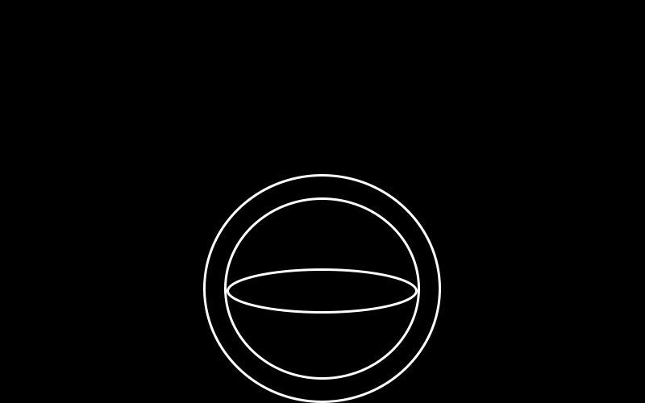
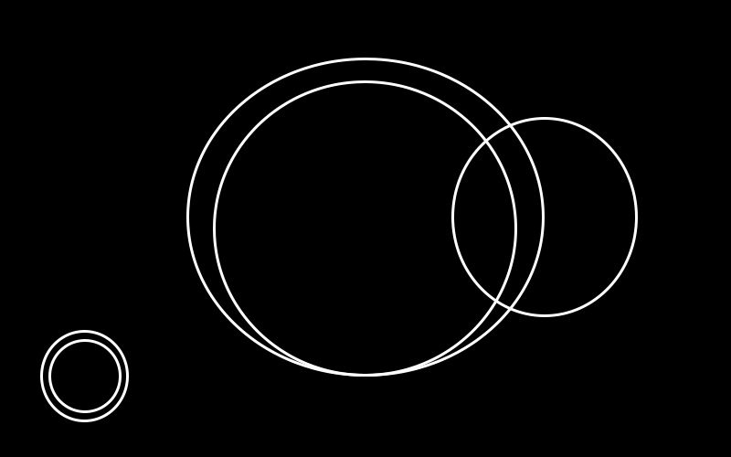
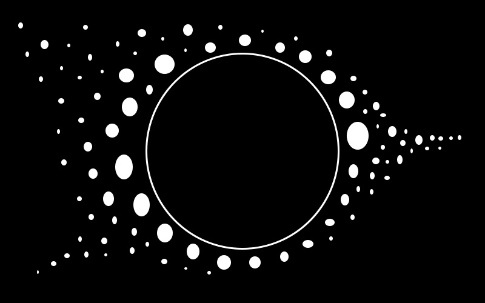

DESIGN PRINCIPLES
---------------------------------------------------
Designprinciperna är de som sätter samman elementen på olika sätt.
Det finns specifika riktlinjer för vad som är visuellt attraktivt i en design, det kallas för principerna.

Jag har valt att arbeta med balance, space & rythm.

### Balance
Balance finns i tre typer - asymmetrisk, symmetrisk samt radial. Det handlar om att designen ska
se balanserad ut. Det bestäms av hur mycket som finns på var sida av centrum, hur elementen är
fördelade. Är det för mycket på någon sida så känns inte designen bra. Symmetrisk betyder att det är exakt detsamma på båda sidorna av centrum medan asymmetrisk betyder att det kan vara olika element på olik plats, men att deras total vikt ändå är i princip densamma.
Radial balans utgår ifrån en cirkel där alla delar är av samma vikt.
Vikt bestäms av storlek och färg på elementen.

  

 Till exempel de röda elementen ger en symmetrisk balans.

 Jag valde att lägga mer tid på den radiala balansen:
 s

### Space
Space är indelat i positive och negative space. Det är inte som det låter, utan enbart namn för att beskriva rummet. Positive space är det område som har så att säga en händelse, alltså ett element som ska fokuseras på och inte enbart vara en bakgrund. Negative space är det rum som ger luftighet, men kan ändå ha ett mönster, en färg eller en struktur. Det är viktigt att dessa två balanseras. Då det är för mycket positive space blir det helt enkelt för mycket. Och då det är för mycket negative space så blir det tråkigt.

Men, med en design i balans så ger negative space luft och andrum åt designen, och positive space får fokus.

### Rythm
Rytm i designen betyder att det finns en rytmisk harmoni i fördelningen av element.

## Källa
Jag har främst använt mig av you-tube clippet <a href='https://www.youtube.com/watch?v=MHCVY_qNye4&list=PLKtP9l5q3ce-oz7aoBkk-oEn4xzGbtqxU&index=7'> Art & Design - Lesson 4 - Elements & Principles of Art </a> av MrReimerArt.
